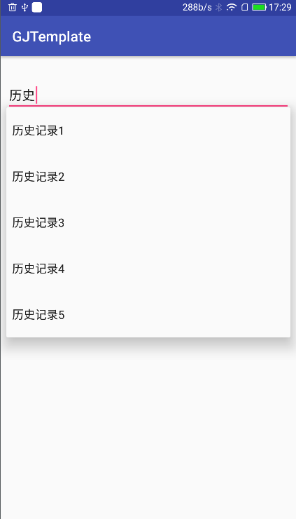

# AutoCompleteTextViewExtend

---
## 效果展示


---
## 介绍说明
* 扩展了保存历史记录的功能,可防止频繁重复输入
---
## 使用说明
* 添加xml
```xml
 <com.gosuncn.actve.AutoCompleteTextViewExtend
            android:id="@+id/autoCompleteTextViewExtend"
            android:layout_width="match_parent"
            android:layout_height="wrap_content"/>
```
* 保存历史记录，AutoCompleteTextViewExtend.saveRecord("")
* 详细请参照demo和查看在线文档

---
## JavaDoc文档

* [在线JavaDoc](https://jitpack.io/com/github/huweijian5/AutoCompleteTextViewExtend/1.0.0/javadoc/index.html)
* 网址：`https://jitpack.io/com/github/huweijian5/AutoCompleteTextViewExtend/[VersionCode]/javadoc/index.html`
* 其中[VersionCode](https://github.com/huweijian5/AutoCompleteTextViewExtend/releases)请替换为最新版本号
* 注意文档使用UTF-8编码，如遇乱码，请在浏览器选择UTF-8编码即可

---
## 引用

* 如果需要引用此库,做法如下：
* Add it in your root build.gradle at the end of repositories:
```
allprojects {
		repositories {
			...
			maven { url "https://jitpack.io" }
		}
	}
```	
* and then,add the dependecy:
```
dependencies {
	        compile 'com.github.huweijian5:AutoCompleteTextViewExtend:latest_version'
}
```
* 其中latest_version请到[releases](https://github.com/huweijian5/AutoCompleteTextViewExtend/releases)中查看并替换

## 注意
* 为了避免引入第三方库导致工程依赖多个版本的问题，如android support库
* 故建议在个人的工程目录下的build.gradle下加入以下变量，具体请看此[build.gradle](https://github.com/huweijian5/项目名称/blob/master/build.gradle)
```
ext{
    minSdkVersion = 16
    targetSdkVersion = 25
    compileSdkVersion = 25
    buildToolsVersion = '25.0.1'

    // App dependencies
    supportLibraryVersion = '25.0.1'
    junitVersion = '4.12'
    espressoVersion = '2.2.2'
}
```	
* 请注意，对于此库已有的变量，命名请保持一致


